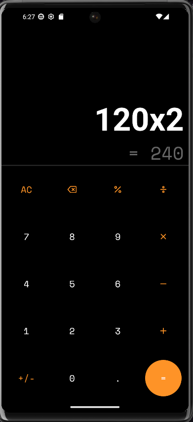
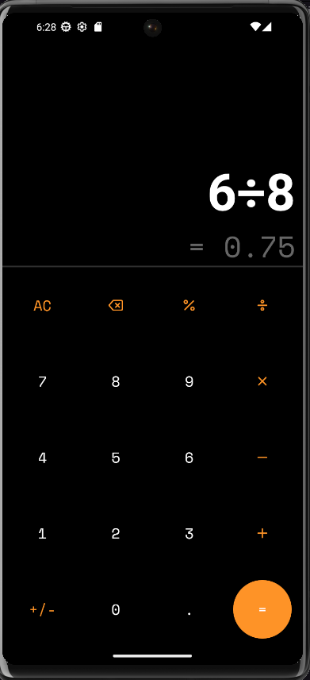

# React Native Calculator 👋

## Description
A sleek and functional calculator developed in **React Native**, inspired by the minimalist design of Xiaomi calculators. This application allows users to perform basic mathematical operations like addition, subtraction, multiplication, and division, with an interface optimized for mobile devices.

---

## Features
- ✅ Minimalist and modern interface.
- ✅ Basic mathematical operations:
  - Addition
  - Subtraction
  - Multiplication
  - Division
- ✅ Responsive for different screen sizes.
- ✅ Inspired by Xiaomi calculator design.
- ✅ Lightweight and easy to use.

---

## Screenshots
```markdown


```

---

## Technologies Used
- **React Native**: Main framework for app development.
- **Expo**: Simplifies environment setup and app development.
- **JavaScript**: Core language for application logic.
- **React Native Vector Icons**: For icons used in the calculator.

---

## System Requirements
- **Node.js**: v20 or higher.
- **Expo CLI**: v5 or higher.
- **Android/iOS device or emulator**.

---

## Installation and Usage

1. Install dependencies

   ```bash
   git clone https://github.com/carlosJCVC/calculator.git
   cd your-repository
   ```

2. Install dependencies

   ```bash
   npm install
   ```

3. Start the app

   ```bash
    npx expo start
   ```

In the output, you'll find options to open the app in a

- [development build](https://docs.expo.dev/develop/development-builds/introduction/)
- [Android emulator](https://docs.expo.dev/workflow/android-studio-emulator/)
- [iOS simulator](https://docs.expo.dev/workflow/ios-simulator/)
- [Expo Go](https://expo.dev/go), a limited sandbox for trying out app development with Expo

You can start developing by editing the files inside the **app** directory. This project uses [file-based routing](https://docs.expo.dev/router/introduction).

## Get a fresh project

When you're ready, run:

```bash
npm run reset-project
```

This command will move the starter code to the **app-example** directory and create a blank **app** directory where you can start developing.

## Learn more

To learn more about developing your project with Expo, look at the following resources:

- [Expo documentation](https://docs.expo.dev/): Learn fundamentals, or go into advanced topics with our [guides](https://docs.expo.dev/guides).
- [Learn Expo tutorial](https://docs.expo.dev/tutorial/introduction/): Follow a step-by-step tutorial where you'll create a project that runs on Android, iOS, and the web.

## Join the community

Join our community of developers creating universal apps.

- [Expo on GitHub](https://github.com/expo/expo): View our open source platform and contribute.
- [Discord community](https://chat.expo.dev): Chat with Expo users and ask questions.
